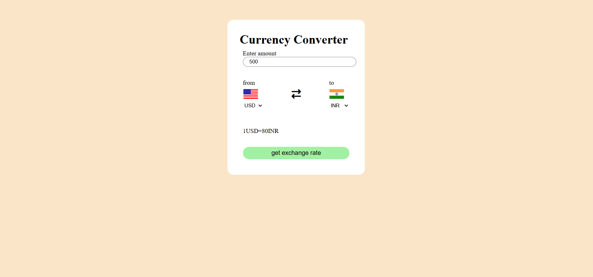

💱 Currency Converter

A sleek and responsive web app to convert currencies in real-time using a free API. Perfect for travelers, finance enthusiasts, or anyone who wants quick currency conversions!

📝 Features

🌍 Convert between multiple currencies instantly

📊 Real-time exchange rates

🎨 Clean and responsive interface

⚡ Lightweight and fast

🚨 Handles invalid or missing inputs gracefully

💻 Technologies Used

HTML5 – Markup structure

CSS3 – Styling and responsiveness

JavaScript (ES6+) – Functionality

Free Currency API
 – Real-time exchange rates

🚀 Installation & Setup

Clone the repo:

git clone https://github.com/yourusername/currency-converter.git

Open index.html in your browser

Add your API key in script.js:

const apiKey = "YOUR_API_KEY";

🎯 How to Use

Enter the amount you want to convert

Select the currency you’re converting from

Select the currency you’re converting to

Click Convert and see the result instantly

🔗 API Endpoint

Base URL:

https://api.freecurrencyapi.com/v1/latest?apikey=YOUR_API_KEY&base_currency=USD&currencies=EUR,INR,...

📸 Screenshot
 

 Soumya Jain